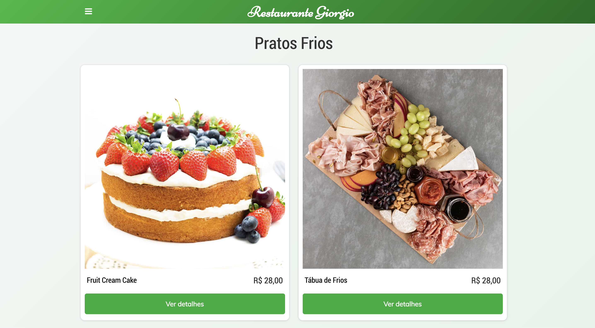

## The Project 
This is a web-responsive project created for Giorgio's Italian Restaurant. The goal was to develop a menu in which the clients could see all sorts of meals in images and Augmented Reality (AR) objects.

## Technologies
The technologies used were:
- JavaScript;
- HTML;
- CSS;
- Git and GitHub.

## Layout
Get your cellphone or tablet and check the [menu here](https://brennoeudes.github.io/giorgo-restaurant/). 
 
ps: The AR objects only work on mobile devices.